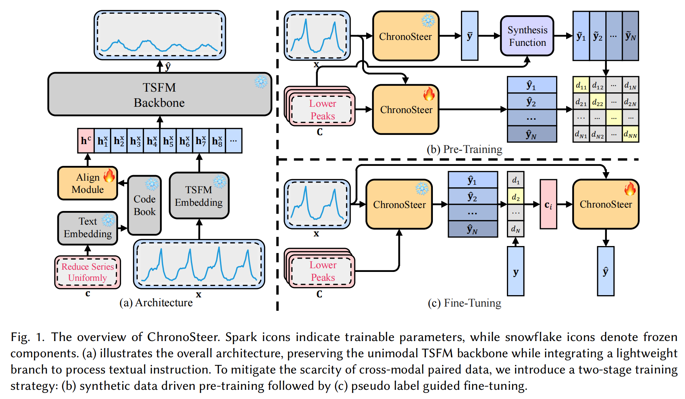
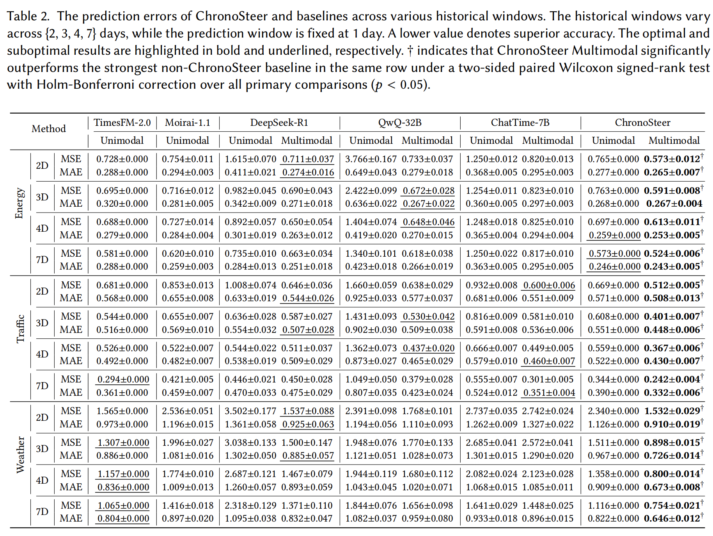
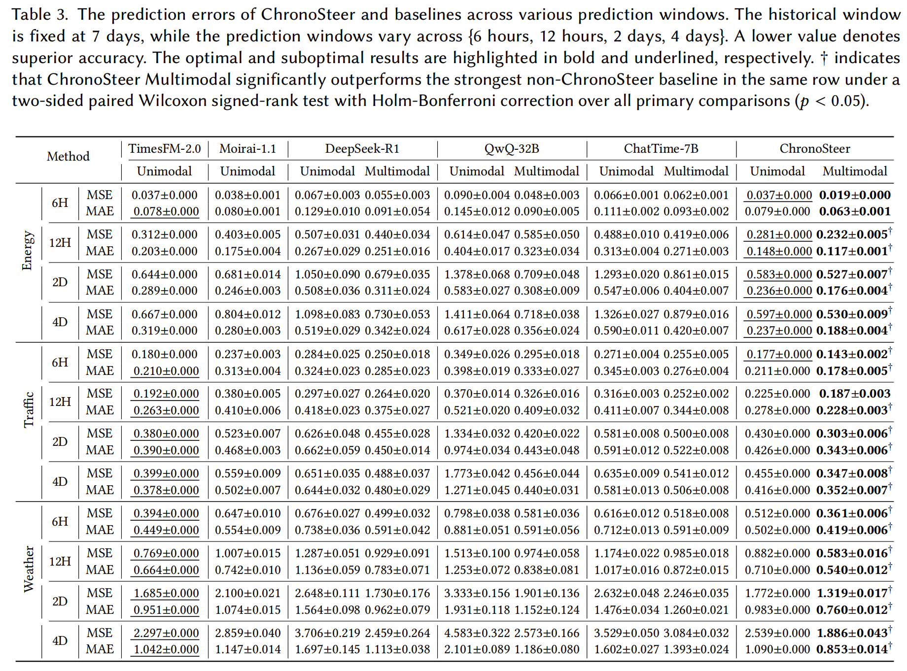

<div align="center">

# ChronoSteer: Bridging LLMs and TSFMs

<a href="https://arxiv.org/abs/2505.10083"></a>
<a href="https://huggingface.co/datasets/ChengsenWang/ChronoSteer-100K"></a>
<a href="https://huggingface.co/datasets/ChengsenWang/MTSFBench-300"></a>
<a href="https://drive.google.com/drive/folders/1hjH2vtqNjpmcrFmau8V06ML5wp3lPx_i?usp=sharing"></a>

</div>

## ✨ Introduction

Conventional forecasting methods are trained end-to-end on unimodal time series, which limits their ability to exploit textual information and undermines their generalization in data-scarce scenarios. Recently, large language models (LLMs) and time series foundation models (TSFMs) have demonstrated powerful capabilities in complex textual reasoning and zero-shot temporal modeling, respectively. Integrating these strengths to construct a multimodal time series foundation model that jointly leverages temporal and textual information for zero-shot future inference has emerged as a promising research direction. However, the scarcity of large-scale, high-quality multimodal datasets remains a fundamental obstacle. To address this challenge, we propose ChronoSteer, a decoupled agentic framework that learns cross-modal alignment from synthetic paired supervision. Specifically, a pretrained LLM first converts textual events into revision instructions that steer the initial unimodal prediction produced by a frozen TSFM. These revision instructions form an intermediate instruction space that bridges the semantic gap between text and time series while fully leveraging pretrained knowledge. Technically, the instructions are discretized into a compact codebook of instruction anchors, effectively mitigating semantic divergence while reducing the cost of dataset construction. Finally, we adopt a two-stage training strategy to recover the fine-grained magnitude information lost during discretization. Furthermore, we release a leakage-controlled multimodal benchmark constructed with temporal separation and textual context available before the prediction window. When paired with an LLM and trained on synthetic cross-modal alignment data, ChronoSteer achieves a 25.8% improvement in zero-shot prediction accuracy over its unimodal backbone, and outperforms prior state-of-the-art unimodal and multimodal methods by 17.8% and 22.5%. These results suggest that synthetic paired supervision is a promising direction for multimodal time series analysis.



## 📊 Results

ChronoSteer is evaluated with mean squared error (MSE) and mean absolute error (MAE) under different historical and forecasting windows. It consistently improves the multimodal forecasts over the corresponding unimodal backbone and surpasses representative TSFM- and LLM-based baselines across energy, traffic, and weather domains.

The following results use a fixed 1-day forecasting window and vary the historical window from 2 to 7 days.



The following results use a fixed 7-day historical window and vary the forecasting horizon from 6 hours to 4 days.



## 🚀 Usage

### Environment

All experiments in the paper are conducted with Python 3.10.13 and PyTorch 2.1.2.

```bash
conda create -n chronosteer python=3.10.13
conda activate chronosteer

pip install torch==2.1.2 numpy pandas scikit-learn einops tqdm FlagEmbedding chronos-forecasting jupyter matplotlib
```

Install a PyTorch build compatible with your CUDA environment if the command above does not match your system.

### Preparation

#### Foundation Models

ChronoSteer uses the following open-source models:

- TSFM backbone: [`amazon/chronos-bolt-base`](https://huggingface.co/amazon/chronos-bolt-base)
- Text embedding model: [`BAAI/bge-m3`](https://huggingface.co/BAAI/bge-m3)

Both models are downloaded automatically from Hugging Face when first used.

#### Datasets and Checkpoints

Download the resources required for training and evaluation:

- Training data: [ChronoSteer-100K](https://huggingface.co/datasets/ChengsenWang/ChronoSteer-100K)
- Evaluation data: [MTSFBench-300](https://huggingface.co/datasets/ChengsenWang/MTSFBench-300)
- Released alignment weights: [ChronoSteer checkpoints](https://drive.google.com/drive/folders/1hjH2vtqNjpmcrFmau8V06ML5wp3lPx_i?usp=sharing)

Place them in the following locations:

```text
dataset/
├── ChronoSteer-100K/
│   └── data/
│       └── ChronoSteer-100K.json
└── MTSFBench-300/
    └── data/
        └── rev-test-reply.json

log/
└── ChronoSteer-base/
    └── checkpoint/
        ├── pretrain_align_checkpoint.pth
        └── finetune_align_checkpoint.pth
```

#### Revision Instructions

For multimodal forecasting, an LLM API is used to generate a revision instruction from the historical series, the initial TSFM forecast, and the available textual context. This repository does not include the prompt-construction or LLM API code. Please refer to the [paper](https://arxiv.org/abs/2505.10083) and the released [MTSFBench-300](https://huggingface.co/datasets/ChengsenWang/MTSFBench-300) dataset for the instruction-generation setting and prepared examples.

The released `rev-test-reply.json` already contains the instruction embeddings required by the evaluation code, so reproducing the reported results does not require an additional LLM API call.

### 1. Training

Run the complete training and evaluation pipeline with:

```bash
python main.py
```

The command sequentially performs synthetic cross-modal pre-training, pseudo-label generation and fine-tuning, and evaluation. The Chronos-Bolt backbone remains frozen; only the lightweight alignment module is trained. Checkpoints and evaluation results are saved under `./log/ChronoSteer-base/` by default.

Custom paths can be provided through command-line arguments:

```bash
python main.py \
  --train_data ./dataset/ChronoSteer-100K/data/ChronoSteer-100K.json \
  --test_data ./dataset/MTSFBench-300/data/rev-test-reply.json \
  --tsfm_path amazon/chronos-bolt-base \
  --embed_path BAAI/bge-m3 \
  --save_path ./log/
```

### 2. Inference

To evaluate the released checkpoints without repeating pre-training or fine-tuning, run:

```bash
python main.py --only_test
```

This command loads both alignment checkpoints and evaluates unimodal and multimodal forecasting on MTSFBench-300. Predictions, per-sample metrics, and grouped MSE/MAE results are saved under `./log/ChronoSteer-base/result/`.

### 3. Demo

Run the interactive forecasting demo with:

```bash
jupyter notebook demo.ipynb
```

[`demo.ipynb`](./demo.ipynb) visualizes how the nine revision instructions steer forecasts for the same historical time series. It currently uses `cuda:0` by default; update the device setting in the notebook if necessary.

## 📁 Repository Structure

```text
ChronoSteer/
├── data/
│   └── dataset.py          # Dataset loading and sample construction
├── model/
│   ├── align.py            # Text-to-time-series alignment module
│   ├── loss.py             # Forecasting and contrastive objectives
│   └── model.py            # ChronoSteer model built on Chronos-Bolt
├── solver/
│   └── solver.py           # Pre-training, fine-tuning, and evaluation
├── utils/
│   ├── stopper.py          # Early stopping and checkpoint saving
│   └── tool.py             # Reproducibility and evaluation utilities
├── image/
│   ├── method.png          # Method overview
│   ├── result1.png         # Results across historical windows
│   └── result2.png         # Results across forecasting horizons
├── demo.ipynb              # Interactive steering demonstration
└── main.py                 # Main training and evaluation entry point
```

## 📝 Citation

If you find ChronoSteer useful in your research, please cite our paper:

```bibtex
@article{wang2025chronosteer,
    author  = {Chengsen Wang and Qi Qi and Zhongwen Rao and Lujia Pan and Jingyu Wang},
	title   = {ChronoSteer: Bridging Large Language Model and Time Series Foundation Model via Synthetic Cross-Modal Alignment Dataset},
    journal = {ACM Transactions on Knowledge Discovery from Data},
    year    = {2026},
}
```

## 📪 Contact

For questions about the paper, datasets, checkpoints, or code, please open a GitHub issue or contact [cswang@bupt.edu.cn](mailto:cswang@bupt.edu.cn).
